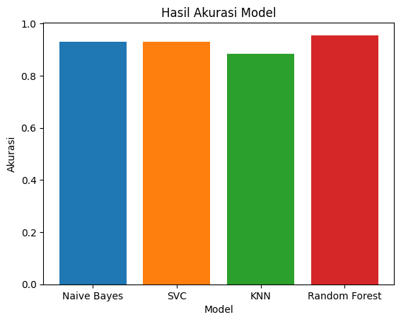

# Laporan Proyek Machine Learning - Rachmat Risky Saputra

## Domain Proyek

Domain yang saya pilih untuk proyek predictive analysis menggunakan machine learning ini adalah di bidang pertanian. Dengan judul: Klasifikasi Kualitas Buah Anggur.

### Latar Belakang

Buah anggur termasuk salah satu buah yang cukup digemari di berbagai belahan dunia. Selain rasanya yang enak, anggur juga praktis karena bisa langsung dimakan tanpa harus dikupas terlebih dahulu. Tanaman anggur berasal dari wilayah Amerika, Eropa, dan Asia, dan umumnya tumbuh lebih baik di musim kemarau dibanding musim hujan. Karena itulah, anggur dikenal sebagai "tanaman hari panjang" atau Long Day Plant. Selain dimakan langsung, anggur juga sering diolah menjadi kismis, yang semakin memperkaya penggunaannya di dunia kuliner[[1](https://digitani.ipb.ac.id/mengenal-tanaman-anggur-morfologi-dan-karakteristiknya/)]. Dari sisi kesehatan, anggur menyimpan banyak manfaat. Beberapa di antaranya adalah membantu mencegah kanker, meningkatkan daya ingat, menjaga kesehatan mata, mengontrol tekanan darah, hingga memperlambat proses penuaan. Karena nilai manfaat dan ekonominya, kini semakin banyak masyarakat, terutama yang tinggal di daerah pesisir, mulai membudidayakan berbagai jenis anggur. Namun, masih banyak orang—terutama pedagang dan pecinta buah anggur—yang belum benar-benar memahami perbedaan jenis anggur berdasarkan warnanya. Selama ini, pengelompokan jenis anggur masih dilakukan secara manual hanya dengan mengandalkan penglihatan, sehingga sering terjadi perbedaan pendapat antar individu dalam mengidentifikasi jenis dan warnanya[[2](https://www.academia.edu/download/103003983/3016.pdf)]. Melihat tantangan tersebut, penulis menawarkan sebuah solusi berbasis teknologi, yaitu dengan menerapkan analisis prediktif dalam studi kasus klasifikasi kualitas buah anggur. Proses klasifikasi ini mempertimbangkan beberapa kriteria seperti tingkat kemanisan, keasaman, asal geografis, hingga intensitas paparan sinar matahari. Diharapkan, proyek ini dapat membantu para petani dalam menilai kualitas buah anggur secara otomatis, sehingga bisa meningkatkan efisiensi, produktivitas, serta nilai jual anggur di pasaran.

## Business Understanding
pengembangan model klasifikasi kualitas buah anggur memiliki potensi yang bermanfaat khususnya untuk para petani buah anggur. salah satu contoh potensi dan manfaat model klasifikasi ini adalah dapat membantu para petani melakukan pemilahan buah anggur secara otomatis sesuai dengan kriteria yang sudah diklasifikasikan oleh model.

### Problem Statements
Berdasarkan latar belakang di atas, berikut ini adalah rincian masalah yang dapat diselesaikan proyek ini:
- Jenis model apa yang memiliki akurasi terbaik untuk studi kasus klasifikasi kualitas buah anggur?
- Bagaimana model ini bisa membantu petani meningkatkan kualitas buah anggur mereka?

### Goals
Tujuan dari proyek ini antara lain adalah sebagai berikut:
- Membuat model machine learning yang dapat mengklasifikasikan kualitas buah anggur berdasarkan dataset yang terdiri dari data baris dan kolom.
- mengembangkan sebuah sistem atau aplikasi yang berbasis machine learning untuk membantu petani mengklasifikasikan kualitas buah anggur secara otomatis.
- Membandingkan beberapa algoritma model untuk menemukan model mana yang paling cocok dan memiliki akurasi terbaik untuk kasus klasifikasi kualitas buah anggur.

### Solution statements
- Melakukan Exploratory Data Analysis (EDA). Pada tahap ini, akan dilakukan analisis univariat dan multivariat, dilengkapi dengan visualisasi data untuk membantu memahami karakteristik data secara menyeluruh. EDA bertujuan untuk menemukan pola, tren, serta mengidentifikasi hubungan atau korelasi antar variabel. Temuan dari tahap ini akan menjadi dasar dalam pengambilan keputusan untuk pengembangan model machine learning yang lebih optimal.
- Dalam proyek ini, beberapa model machine learning dibuat untuk membandingkan dan menentukan model mana yang paling tepat digunakan dalam prediksi kualitas buah anggur. Beberapa metode yang digunakan antara lain:
    - Naive Bayes 
      Naive Bayes adalah metode klasifikasi berdasarkan Teorema Bayes dengan asumsi bahwa setiap fitur bersifat independen. Meskipun asumsi ini jarang terpenuhi sepenuhnya dalam kenyataan, model ini tetap efektif dan banyak digunakan, terutama untuk teks atau data kategorikal.
    - Support Vector Classifier (SVC) 
      SVC adalah algoritma yang mencari hyperplane terbaik yang memisahkan data ke dalam kelas yang berbeda. Tujuan utama SVC adalah memasimalkan margin antara hyperplane dan titik data terdekat dari setiap kelas (support vectors). SVC dapat bekerja dengan data yang tidak dapat dipisahkan secara linear menggunakan kernel trick.
    - K-Nearest Neighbor (KNN) 
      KNN adalah algoritma yang digunakan untuk klasifikasi dan regresi, dengan cara membandingkan data baru dengan sejumlah data terdekat di sekitarnya (tetangga terdekat). Model ini tidak membangun fungsi prediksi secara eksplisit, melainkan menyimpan semua data pelatihan dan mengklasifikasikan berdasarkan mayoritas label dari tetangganya.
    - Random Forest 
      Random Forest merupakan metode ensemble learning yang menggunakan kombinasi dari banyak decision tree. Setiap pohon akan memberikan prediksi, dan hasil akhirnya adalah kombinasi (rata-rata atau voting) dari semua prediksi tersebut. Ini membuat Random Forest tahan terhadap overfitting dan cocok untuk klasifikasi maupun regresi.

## Data Understanding
Paragraf awal bagian ini menjelaskan informasi mengenai data yang Anda gunakan dalam proyek. Sertakan juga sumber atau tautan untuk mengunduh dataset. Contoh: [UCI Machine Learning Repository](https://archive.ics.uci.edu/ml/datasets/Restaurant+%26+consumer+data).
**Informasi tentang dataset**
| Kategori | Keterangan |
| ----- | ----- |
| Nama Dataset | Grape Quality |
| Sumber | [Kaggle.com](https://www.kaggle.com/datasets/mrmars1010/grape-quality) |
| Pemilik | [Mars_1010](https://www.kaggle.com/mrmars1010) |
| Lisensi | Apache 2.0 |
| Visibilitas | Publik |
| Tag | food |
| Skor Usibilitas | 10.00 |

### Jumlah Data:
Pada dataset Grape Quality ini terdapat sebanyak 1000 baris dan 13 kolom.

### Kondisi Data:
Dataset ini cukup bersih, tidak ditemukan baik itu data yang hilang, duplikat data ataupun outlier.

### Variabel-variabel pada Grape Quality Dataset adalah sebagai berikut:
- sample_id: Nomor unik untuk setiap sampel anggur. Seperti nomor identitas untuk membedakan satu sampel dengan lainnya.
- variety: Jenis atau varietas anggur (contoh: Carbenet Sauvignon, Merlot, dll).
- region: Wilayah atau daerah tempat anggur ditanam. Setiap daerah punya iklim berbeda yang mempengaruhi kualitas anggur.
- quality_score: Skor angka yang menunjukkan sebebarapa bagus kualitas anggur (semakin tinggi, semakin bagus).
- quality_category: Kategori dari skor kualitas, dikelompokkan menjadi "Low", "Medium", "High", dan "Premium". Ini memudahkan untuk studi kasus klasifikasi.
- sugar_content_brix: Tingkat rasa manis anggur, diukur dalam satuan Brix (°Bx). Semakin tinggi Brix, semakin manis anggurnya.
- acidity_ph: Tingkat keasaman anggur. pH < 7 berarti asam. semakin rendah pH, semakin asam rasa anggurnya.
- cluster_weight_g: Berat satu tandan (sekumpulan) buah anggur, dalam satuan gram.
- berry_size_mm: Ukuran satu butir anggur, diukur dalam milimeter (mm).
- harvest_date: Tanggal kapan anggur dipanen. Waktu panen bisa mempengaruhi rasa manis, asam, dan kualitas keseluruhan.
- sun_exposure_hours: Total jumlah jam anggur terkena sinar matahari. Sinar matahari membantu anggur matang dengan baik.
- soil_moisture_percent: Persentase kadar air dalam tempat anggur tumbuh. Ini mempengaruhi pertumbuhan dan rasa buah.
- rainfall_mm: Jumlah curah hujan (dalam milimeter) yang diterima kebun anggur selama masa tumbuh.

## Data Preparation
Tahapan data preparation atau persiapan data merupakan proses penting sebelum membangun model machine learning. Tujuan utamanya adalah memastikan data dalam kondisi bersih, konsisten, dan sesuai untuk dianalisis, sehingga model yang dibangun dapat menghasilkan prediksi yang akurat dan andal. Berikut adalah tahapan data preparation yang dilakukan dalam proyek ini:
1. Encoding Fitur-Fitur Kategori 
Pada langkah ini saya melakukan konversi fitur-fitur kategori menjadi angka agar bisa digunakan untuk pelatihan model machine learning. Saya menggunakan teknik one-hot encoding dengan menggunakan fungsi get_dummies(). Hal ini penting dilakukan karena:
    - Cocok untuk data kategori tanpa urutan, sehingga model tidak salah mengintrepretasikan hubungan antar kategori.
    - Menghindari kehilangan informasi yang bisa terjadi jika menggunakan label encoding.
2. Drop fitur-fitur yang tidak relevan 
    Pada langkah ini saya menghapus 3 fitur dari dataset, adalah sebagai berikut: quality_category, sample_id, harvest_date. 
    Saya menghapus ketiga fitur di atas karena memang tidak relevan dan tidak saya gunakan untuk pelatihan model machine learning.
    Langkah ini penting dilakukan dengan tujuan antara lain:
    - Menghindari model belajar dari data yang tidak penting
    - Mencegah model menjadi terlalu rumit dengan fitur yant tidak relevan.
    - Mengurangi wkatu komputasi dan memori yang dibutuhkan.
3. Melakukan pembagian data latih dan data uji (Train-Test-Split) 
Pada langkah ini saya menggunakan fungsi train_test_split() untuk membagi dataset menjadi data latih dan data uji. Dengan data latih sebesar 80% dan data uji 20%. Langkah ini diperlukan untuk mengevaluasi kinerja model secara akurat. Dengan membagi dataset menjadi data latih (80%) dan data uji (20%), kita bisa memastikan model belajar pola yang benar dan mampu bekerja dengan baik pada data baru, bukan hanya data yang sudah dilatih. Ini juga membantu mencegah overfitting dan memastikan hasil yang lebih reliable sesuai dengan studi kasus di dalam proyek ini.
4. Standarisasi Data Latih 
Pada langkah ini saya melakukan standarisasi pada fitur numerik di dalam data latih (X_train) menggunakan StandardScaler(). Fitur-fitur yang distandarisasi ini bisa membantu model untuk belajar dengan lebih baik dan lebih cepat dengan menyamakan skala semua fitur. Selain itu, langkah ini juga memastikan bahwa model tidak bias terhadap fitur dengan skala lebih besar, sehingga fitur setiap fitur berkontribusi secara proposional dalam membuat prediksi.

## Model Development
Pada proyek ini terdapat 4 algoritma yang digunakan, yaitu:
1. Naive Bayes 
Naive Bayes adalah algoritma klasifikasi berbasis teori probabilitas Bayes dengan asumsi bahwa setiap fitur yang terdapat di dalam data bersifat independen satu sama lain (naive). Algoritma ini menghitung probabilitas setiap kelas untuk data yang diberikan dan memilih kelas dengan probabilitas tertinggi sebagai prediksi. Parameter yang saya gunakan adalah parameter default.
     - Kelebihan: 
        - Proses pelatihan dan prediksi sangat cepat, cocok untuk dataset besar.
        - Mudah untuk dipahami dan diimplementasikan.
    - Kekurangan: 
        - Tidak fleksibel terhadap data numerik yang kompleks atau tidak terdistribusi dengan normal.
        - Asumsi independensi antar fitur sering kali tidak realistis dan dapat menurunkan akurasi.

2. Support Vector Classifier (SVC) 
SVC adalah algoritma yang mencari hyperplane terbaik yang memisahkan data ke dalam kelas yang berbeda. Tujuan utama SVC adalah memasimalkan margin antara hyperplane dan titik data terdekat dari setiap kelas (support vectors). SVC dapat bekerja dengan data yang tidak dapat dipisahkan secara linear menggunakan kernel trick.
    - Kelebihan: 
        - Sangat efektif pada data berdimensi tinggi (banyak fitur).
        - Dapat menangani hubungan non-linear melalui berbagai jenis kernel. 
    - Kekurangan: 
        - Komputasi bisa sangat lambat untuk dataset besar.
        - Pemilihan kernel dan parameter tuning bisa cukup kompleks.

3. K-Nearest Neighbors (KNN) 
KNN adalah algoritma berbasis instance yang mengklasifikasikan titik data baru berdasarkan kelas mayoritas dari K tetangga terdekat. Algoritma ini menghitung jarak antara titik yang akan diklasifikasikan dengan titik-titik dalam data pelatihan, biasanya menggunakan jarak Euclidean. Pada model ini terdapat dua parameter yang saya gunakan. Pertama adalah n_neighbors yaitu jumlah tetangga terdekat untuk voting dengan nilai 5 dab weights dengan nilai "distance" yang berarti tetangga atau neighbor yang lebih dekat akan memiliki bobot lebih tinggi dalam voting, sehingga lebih berpengaruh pada prediksi, untuk parameter lainnya tetap default.
    - Kelebihan: 
        - termasuk algoritma yang sederhana dan mudah dipahami, cocok untuk pemula yang baru belajar machine learning.
        - Dapat digunakan untuk klasifikasi dan regresi.
    - Kekurangan: 
        - sangat sensitif terhadap skala data dan outlier; butuh normalisasi
        - Prediksi bisa lambat karena harus menghitung jarak ke semua data pelatihan.

4. Random Forest 
Random Forest adalah algoritma ensemble yang menggabungkan bnayak pohon keputusan (decision trees) secara acak dan menggabungkan hasilanya untuk membuat prediksi yang lebih akurat dan stabil. Algoritma ini menggunakan teknik bootstrap aggregation (bagging) untuk mengurangi overfitting. Pada model ini parameter yang saya gunakan adalah n_estimators dengan nilai 20, parameter lainnya default. 
    - Kelebihan: 
        - Akurasi tinggi dan kuat terhadap overfitting dibandingkan decision tree tunggal.
        - Dapat digunakan untuk klasifikasi, regresi dan estimasi fitur penting.
    - Kekurangan: 
        - Model lebih kompleks dan besar, memakan lebih banyak memori dan waktu.
        - Interpretasi hasil lebih sulit dibandingkan model pohon tunggal.

## Evaluasi Model
Pada tahap evaluasi model, digunakan metrik akurasi (accuracy) sebagai ukuran kinerja. akurasi dihitung dengan menentukan persentase jumlah prediksi yang tepat dibandingkan dengan total keseluruhan prediksi yang dilakukan. Rumus yang digunakan adalah:

$$\text{Akurasi} = \frac{\text{TP + TN}}{\text{TN + TP + FN + FP}} \times 100\%$$

Keterangan:
- TP (True Positve): Jumlah data yang benar-benar positif dan berhasil diprediksi dengan benar sebagai positif.
- TN (True Negative): Jumlah data negatif yang diprediksi dengan benar sebagai negatif.
- FP (False Positive): Jumlah data negatif yang diprediksi secara tidak benar sebagai positif (kesalahan tipe 1).
- FN (False Negative): Jumlah data positif yang diprediksi secara tidak benar sebagai negatif (kesalahan tipe 2).

Rumus ini memecah akurasi menjadi rasio antara data yang diklasifikasikan dengan benar (TP dan TN) dengan jumlah total data. Mengalikan dengan 100% mengubah rasio menjadi persentase.

Berikut hasil accuracy 4 buah model yang dikembangkan pada proyek ini:

| Model | Akurasi |
| ----- | ----- |
| Naive Bayes | 0.93 |
| SVM | 0.93 |
| KNN | 0.885 |
| Random Forest | 0.955 |

Tabel 3. Hasil Akurasi

Berdasarkan hasil pengujian pada empat algoritma klasifikasi pada tabel 3 di atas, diketahui bahwa model dengan akurasi tertinggi adalah Random Forest dengan nilai akurasi sebesar 0.975 atau 9.75%. Disusul oleh Naive Bayes dan SVM yang masing-masign mencatatkan akurasi sebesar 93%, serta KNN dengan akurasi 88.5%. 
Melihat perbandingan tersebut, Random Forest menjadi pilihan terbaik untuk digunakan dalam proyek ini karena mampu memberikan performa prediksi yang paling akurat di antara model lainnya. Random Forest sendiri dikenal sebagai algoritma yang cukup andal karena menggabungkan banyak decision tree untuk menghasilkan prediksi yang stabil dan kuat terhadap overfitting. 
Meskipun Naive Bayes dan SVM juga menunjukkan performa yang baik, keduanya masih berada sedikit di bawah Random Forest. Sementara itu, KNN, walaupun sederhana dan mudah dipahami, memiliki akurasi paling rendah dari keempat model yang diuji.
 
Dengan mempertimbangkan faktor akurasi dan keandalan model, maka Random Forest dipilih sebagai model utama untuk memprediksi kualitas buah anggur dalam studi ini.

Berdasarkan hasil dari evaluasi model ini sudah menjawab problem statement yang pertama, yaitu model random forest lah yang memiliki akurasi tertinggi untuk studi kasus klasifikasi buah anggur ini. Kemudian untuk problem statement ke-2, model machine learning yang dilatih menggunakan dataset Grape Quality dapat membantu petani meningkatkan kualitas buah anggur dengan memprediksi kualitas anggur berdasarkan berbagai faktor seperti ukuran, warna, kadar gula, pH, dan tingkat kematangan buah. Dengan mengetahui kategori kualitas anggur sebelum panen, petani bisa melakukan beberapa hal berikut:
- Memanen anggur pada waktu terbaik untuk mendapatkan kualitas tertinggi.
- Menyesuaikan pemupukan, penyiraman, atau pengendalian hama.
- Menghindari panen buah yang kurang berkualitas atau terlalu matang. Dengan ini bisa membantu petani meningkatkan hasil panen dan memaksimalkan keuntungan.
 
Dari hasil evaluasi ini juga sudah berhasil mencapai setiap goals yang diharapkan. 
- Pertama, saya sudah berhasil membuat beberapa model machine learning yang dapat mengklasifikasikan kualitas buah anggur berdasarkan dataset yang terdiri dari baris dan kolom, dalam hal ini saya mengembangkan empat model machine learning dengan empat algoritma yang berbeda.
- Kedua, Saya sudah membandingkan keempat model ini dan menemukan 1 model terbaik yaitu model yang memiliki akurasi paling tinggi, pada hasil evaluasi ini adalah model dengan algoritma Random Forest yang memiliki akurasi sebesar 0.955.

Setiap solution statements yang saya rencanakan telah berdampak pada hasil evaluasi model ini. Pertama, berkaitan dengan proses Exploratory Data Analysis (EDA). Saya melakukan tahap ini untuk mengidentifikasi korelasi antar variabel. Temuan dari tahap ini kemudian menjadi dasar dalam penentuan fitur apa saja yang digunakan untuk pelatihan model machine learning sehingga bisa saya bisa mengembangkan model machine learning untuk klasifikasi dengan akurasi yang cukup tinggi, seperti yang sudah dipaparkan di atas. Kedua, dalam proyek ini saya mengimplementasikan beberapa model agar bisa dibandingkan dan ditentukan model mana yang paling tepat digunakan dalam prediksi kategori kualitas buah anggur, dalam hal ini model yang memiliki akurasi paling tinggi adalah Random Forest.

## Referensi
[1] Digitani IPB (2024). MENGENAL TANAMAN ANGGUR: MORFOLOGI DAN KARAKTERISTIKNYA.

[2] Saputro, W., Sumantri, D. B., & Komputer, I. (2022). Implementasi citra digital dalam klasifikasi jenis buah anggur dengan algoritma K-Nearest Neighbors (KNN) dan data augmentasi. INTECOMS: Journal of Information Technology and Computer Science, 5(2), 248-253. 
